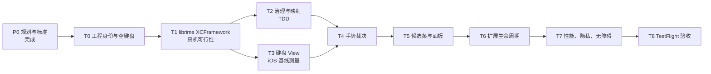

# GY 输入法 iOS 项目计划与进度

> 版本：v1 · 更新：2026-08-05 · 状态：规划已锁定，工程尚未启动
>
> 规范优先：[IOS-PLATFORM-STANDARDS.md](IOS-PLATFORM-STANDARDS.md)；设计范围：[IOS-DESIGN.md](IOS-DESIGN.md)；施工任务：[IOS-V0.1-TASKS.md](IOS-V0.1-TASKS.md)。

## 1. 项目目标

交付一款可在 iPhone 上离线工作的 26 键拼音键盘扩展：基于 librime，具备候选治理、简/EN 切换、候选展开和 iOS 合规的手势能力。

v0.1 固定不请求“完全访问”：键盘不联网，`rime-data`、学习和部署数据位于键盘扩展自身沙箱。微信 Android 版仅作手感研究对象；iOS 系统键盘、公开 API、无障碍和 App Review 是验收标准。

**不在 v0.1 范围内**：GY Link、实时同步、9 键、语音、手写、表情、iPad 浮动/拆分键盘、任意键盘高度调节。

## 2. 当前进度快照

| 工作项 | 状态 | 实际进度 | 证据 / 说明 |
| --- | --- | ---: | --- |
| 产品范围与质量决策 | 完成 | 100% | `IOS-DESIGN.md` 已明确质量优先、全量词库与 v0.1 边界。 |
| iOS 审核、隐私与沙箱标准 | 完成 | 100% | `IOS-PLATFORM-STANDARDS.md` 已锁定，并覆盖旧文档中的冲突表述。 |
| Android 手感借鉴分析 | 完成 | 100% | `IOS-BENCHMARK-ANALYSIS.md` 已建立；尚未进行真机参数测量。 |
| 工程脚手架（`ios/`） | 未开始 | 0% | 仓库目前没有 `ios/` 工程目录或 Xcode project。 |
| librime XCFramework 与键盘扩展可行性 | 未开始 | 0% | 尚无 iOS bridge、数据部署或真机内存数据。 |
| 候选治理 / 索引映射纯 Swift 模块 | 未开始 | 0% | 尚无模块与 XCTest。 |
| 键盘、候选区、手势和生命周期 | 未开始 | 0% | 尚无 iOS UI 实现。 |
| 真机性能、无障碍、TestFlight | 未开始 | 0% | 依赖前序工程完成。 |

**汇总结论：规划与合规基线已完成；v0.1 的实际工程实现为 0%。** 不用文档完成度替代开发进度。

## 3. 里程碑与依赖

| 阶段 | 对应任务 | 产出 | 进入下一阶段的门禁 | 当前状态 |
| --- | --- | --- | --- | --- |
| P0 · 规划与标准 | 文档基线 | 设计、任务、平台标准、风险账本 | 冲突条款均由 iOS 标准覆盖 | 完成 |
| P1 · 工程落地 | T0 | 双 target 空键盘、Bundle ID、CI、启用录屏 | 无完全访问下可安装、启用、Globe 切换 | 未开始 |
| P2 · 引擎可行性 | T1 | `GYRimeBridge` XCFramework、基础词库、部署方案 ADR | `nihao` 能产生“你好”；真机内存/启动基线入库 | 未开始 |
| P3 · 可验证核心 | T2 + T3 | 纯 Swift 治理/映射模块、可访问键盘 View | 映射分支单测全绿；iOS 真机基线表完成 | 未开始 |
| P4 · 输入交互 | T4 + T5 | 手势裁决、候选条和展开面板 | 上下文缺失时安全降级；端到端选词无错位 | 未开始 |
| P5 · 系统适配 | T6 | 预编辑与扩展重建控制器 | 安全/电话/验证码/宿主禁用扩展场景真实记录并通过 | 未开始 |
| P6 · 发布验证 | T7 + T8 | 性能报告、隐私材料、TestFlight 包 | 真机、无障碍、离线、隐私和审核材料全部通过 | 未开始 |

## 4. v0.1 施工计划

### P1：T0 工程身份与空键盘

1. 决定 XcodeGen 或原生 `.xcodeproj`，创建 Container App 与 Keyboard Extension。
2. 锁定 Bundle ID、键盘扩展 ID、签名团队和最低 iOS 版本；在 CI 校验。
3. 设置 `RequestsOpenAccess = NO`，实现按条件显示的 Globe 键和系统输入法切换。
4. 加入 App、Extension、动态库的隐私清单检查；建立 XCTest 与 SwiftLint 门禁。

完成定义：真机可安装、系统设置可启用、无完全访问可输入、可返回下一键盘，并留存录屏。

### P2：T1 引擎可行性先行

1. 比较现有 Hamster/iRime 路径与自建 XCFramework，形成 ADR。
2. 在**键盘扩展自身沙箱**完成 librime 初始化、部署、候选读取、提交和本地 userdb。
3. 将 `rime-data` 纳入扩展 target，验证版本哈希与首次 deploy 的升级路径。
4. 在真机记录冷启动、候选 P95、常驻/峰值内存和内存压力后的恢复情况。

完成定义：`nihao` 候选含“你好”；不使用 App Group 写入；性能数据可复测。

### P3：T2/T3 可并行的核心构建

**T2 治理与映射（先测后写 UI）**

- 实现纯 Swift 候选过滤、去重、池上限和“显示索引 → Rime 原始索引”映射。
- 用 XCTest 覆盖表情、私用区、超长、重复、繁体及“祢蚝/妮恏”回归流。

**T3 键盘 View（先测量后调参）**

- 以 iOS 系统键盘为第一基线，记录键位、气泡、按压、横竖屏和安全区域。
- Android 微信输入法只记录可迁移的参考值，不用于强制复刻。
- 每个按键提供 VoiceOver 标签、值、提示与足够命中区域。

完成定义：映射单测全绿；键盘基线表入库；可在 VoiceOver 下完成基本输入和 Globe 切换。

### P4/P5：交互、候选与生命周期

1. 手势状态机先独立单测：短按、长按、上滑、删除快删、光标移动、取消与方向锁。
2. 光标移动只使用 `UITextDocumentProxy.adjustTextPosition`；不假定有完整上下文或文本选择。
3. 删除恢复和清空撤回仅处理本会话可验证的操作；上下文为 `nil`、宿主变动或扩展重建时安全禁用。
4. 接入候选条、展开面板、简/EN、预编辑和扩展重建控制器。

完成定义：污染候选流的端到端选词无错位；所有高风险文本编辑场景均能安全降级。

### P6：性能、无障碍与 TestFlight

1. 跑小屏、常规尺寸和大屏真机；覆盖当前 iOS 正式版及前两个仍支持版本。
2. 跑横竖屏、离线、扩展回收、内存压力、30 分钟稳定性，以及 VoiceOver、Voice Control、Switch Control。
3. 核对安全文本、电话键盘、验证码和宿主禁用扩展的真实系统行为；不对验证码作必定接管承诺。
4. 完成 `PrivacyInfo.xcprivacy`、Required Reason API 与依赖审计、App Privacy 信息、隐私政策、审核备注和 TestFlight 录屏。

完成定义：每项门禁有测试记录；无输入内容离开设备；TestFlight 可供测试人员安装。

## 5. 质量指标

| 指标 | v0.1 目标 | 测量方式 |
| --- | --- | --- |
| 完全访问 | 不请求 | 系统设置截图 + Info.plist CI 检查 |
| 离线可用 | 全输入链路可用 | 飞行模式真机回归 |
| 候选准确性 | 过滤后提交零错位 | 映射单测 + 端到端污染流 |
| 冷启动 | 内部目标 <300 ms | 真机多次采样，报告 P50/P95 |
| 候选刷新 | 内部目标 P95 <100 ms | 真机埋点，不采集输入内容 |
| 内存 | 45 MB 预警预算，不作为系统上限 | Instruments/内存压力测试 + 恢复验证 |
| 稳定性 | 30 分钟遍历无崩溃、无不可恢复回收 | 真机场景巡检 |
| 无障碍 | 三类辅助能力可完成常用输入 | VoiceOver、Voice Control、Switch Control 验收 |

## 6. 风险与决策点

| 风险 / 决策 | 级别 | 处理方式 | 何时关闭 |
| --- | --- | --- | --- |
| librime 在键盘扩展内的体积、内存和部署稳定性 | 高 | T1 先做最小 XCFramework 真机 POC；不达标不进入 UI 大规模开发 | T1 ADR + 真机报告 |
| 无完全访问与跨端学习/实时 GY Link 的冲突 | 高 | v0.1 不做同步；未来仅评估容器写缓存、键盘只读 | 独立产品/隐私 ADR |
| 宿主文本上下文不完整导致恢复误删 | 高 | 只恢复本会话可验证操作；缺上下文即禁用 | T4/T6 负向测试 |
| 手感研究越界为 Android 复刻 | 中 | iOS 系统键盘为第一基线；不使用竞品资产 | T3/T4 设计评审 |
| App Store 隐私与供应链披露遗漏 | 中 | 每次新增 SDK 均审计 manifest、签名与数据流 | T0、T8 门禁 |
| 最低 iOS 版本与设备矩阵尚未锁定 | 中 | T0 依据当前采用率、Xcode 支持与测试设备决定 | T0 ADR |

## 7. 进度更新规则

1. 只在产出物和完成定义均满足后，将状态改为“完成”；不得以“代码已写”代替“任务完成”。
2. 每周更新一次：本周完成、下周计划、阻塞项、风险变化、真机证据链接。
3. 每个阶段保留 ADR、测试报告和录屏；涉及输入内容的日志只记录耗时、状态码与匿名聚合指标。
4. 若平台规则、Xcode 或 iOS 正式版变化，先复核 `IOS-PLATFORM-STANDARDS.md`，再调整本计划。

## 8. 下一步（立即执行）

**开始 T0**：确定工程生成方式与身份字段，创建 `ios/` 双 target 空工程，并在真机完成“安装 → 启用 → 无完全访问 → Globe 切换 → 离线输入”的首条验收证据。
